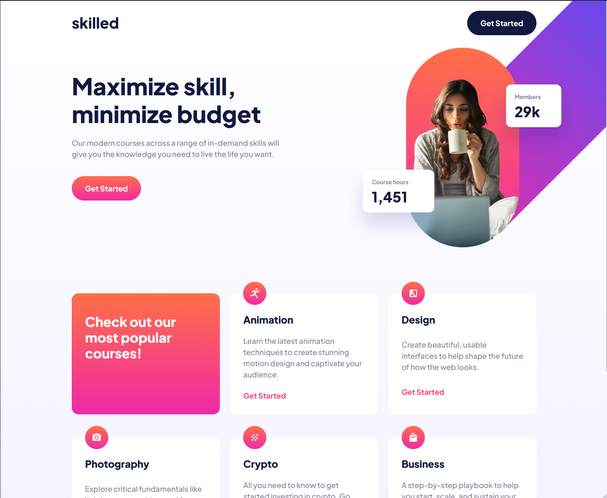

# Frontend Mentor - Skilled e-learning landing page solution

This is a solution to the [Skilled e-learning landing page challenge on Frontend Mentor](https://www.frontendmentor.io/challenges/skilled-elearning-landing-page-S1ObDrZ8q). Frontend Mentor challenges help you improve your coding skills by building realistic projects.

## Table of contents

- [Frontend Mentor - Skilled e-learning landing page solution](#frontend-mentor---skilled-e-learning-landing-page-solution)
  - [Table of contents](#table-of-contents)
  - [Overview](#overview)
    - [The challenge](#the-challenge)
    - [Screenshot](#screenshot)
    - [Links](#links)
  - [My process](#my-process)
    - [Built with](#built-with)
    - [What I learned](#what-i-learned)

## Overview

### The challenge

Users should be able to:

- View the optimal layout depending on their device's screen size
- See hover states for interactive elements

### Screenshot



### Links

- Live Site URL: https://famous-starlight-91e927.netlify.app/

## My process

### Built with

- Semantic HTML5 markup
- CSS custom properties
- Flexbox
- CSS Grid
- Mobile-first workflow
- Intrinsic web design

### What I learned

- I used the content-grid approach to setup the macro layout of the page instead of going for the classic wrapper approach.
- Used grid auto-fit to create fully responsive grid items

```css
.content-grid {
  --content-max-width: 1120px;
  --padding-inline: 1.25rem;

  display: grid;
  grid-template-columns:
    [full-width-start]
    minmax(var(--padding-inline), 1fr)
    [content-start]
    min(50% - var(--padding-inline), (var(--content-max-width) / 2))
    [center-line]
    min(50% - var(--padding-inline), (var(--content-max-width) / 2))
    [content-end]
    minmax(var(--padding-inline), 1fr)
    [full-width-end];
}
```

```css
.courses {
  grid-template-columns: repeat(auto-fit, minmax(min(100%, 20rem), 1fr));
}
```
